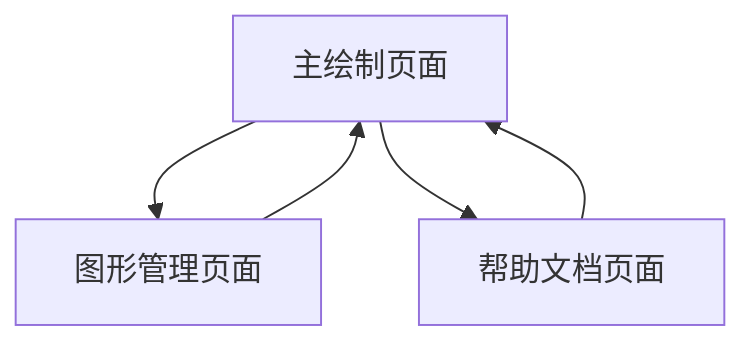

# HyperNetX 动态超图绘制工具产品需求文档

## 1. 产品概述

本产品是一个基于 HyperNetX 的交互式动态超图可视化绘制工具，支持用户通过输入节点和边的信息来实时绘制和编辑超图结构。

超图与普通图的核心区别在于边的类型：超边可以连接多个节点（以椭圆形包围显示），普通边仅连接两个节点（直线显示）。

该工具旨在为研究人员和数据分析师提供直观、高效的超图构建和分析平台。

## 2. 核心功能

### 2.1 用户角色

| 角色 | 注册方式 | 核心权限 |
|------|----------|----------|
| 默认用户 | 直接访问 | 可创建、编辑、保存超图，使用所有绘制和交互功能 |

### 2.2 功能模块

我们的超图绘制工具包含以下主要页面：

1. **主绘制页面**：画布区域、工具栏、节点边输入面板、属性设置面板
2. **图形管理页面**：保存的图形列表、导入导出功能、图形预览
3. **帮助文档页面**：使用说明、超图概念介绍、操作指南

### 2.3 页面详情

| 页面名称 | 模块名称 | 功能描述 |
|----------|----------|----------|
| 主绘制页面 | 画布区域 | 显示超图结构，支持缩放、平移、节点拖拽操作 |
| 主绘制页面 | 节点管理 | 添加、删除、编辑节点，设置节点属性（名称、颜色、大小） |
| 主绘制页面 | 边管理 | 创建超边和普通边，选择连接的节点，设置边的样式 |
| 主绘制页面 | 工具栏 | 选择工具、撤销重做、清空画布、保存图形 |
| 主绘制页面 | 属性面板 | 显示和编辑选中元素的详细属性 |
| 图形管理页面 | 图形列表 | 显示已保存的超图，支持搜索、排序、删除操作 |
| 图形管理页面 | 导入导出 | 支持 JSON、GraphML 格式的图形数据导入导出 |
| 帮助文档页面 | 使用指南 | 提供详细的操作说明和最佳实践建议 |
| 帮助文档页面 | 概念介绍 | 解释超图、超边、普通边等核心概念 |

## 3. 核心流程

**主要用户操作流程：**

1. 用户进入主绘制页面，看到空白画布
2. 通过节点管理面板添加节点，节点出现在画布上
3. 选择边管理工具，创建超边（选择多个节点）或普通边（选择两个节点）
4. 使用拖拽功能调整节点位置，实时更新边的连接
5. 通过属性面板修改节点和边的样式属性
6. 保存当前图形到图形管理页面
7. 可选择导出图形数据或查看帮助文档

## 4. 用户界面设计

### 4.1 设计风格

- **主色调**：深蓝色 (#2563eb) 和浅灰色 (#f8fafc)
- **辅助色**：绿色 (#10b981) 用于确认操作，红色 (#ef4444) 用于删除操作
- **按钮样式**：圆角矩形，带有轻微阴影效果
- **字体**：主要使用 14px 的无衬线字体，标题使用 18px 加粗
- **布局风格**：左侧工具面板 + 中央画布 + 右侧属性面板的三栏布局
- **图标风格**：使用简洁的线性图标，支持悬停高亮效果

### 4.2 页面设计概览

| 页面名称 | 模块名称 | UI 元素 |
|----------|----------|----------|
| 主绘制页面 | 画布区域 | 白色背景，网格辅助线，支持鼠标滚轮缩放和拖拽平移 |
| 主绘制页面 | 左侧工具栏 | 垂直排列的工具按钮，包含选择、添加节点、添加边等功能 |
| 主绘制页面 | 右侧属性面板 | 表单样式的属性编辑器，根据选中元素动态显示相关属性 |
| 主绘制页面 | 顶部菜单栏 | 水平排列的功能按钮，包含保存、导入、导出、帮助等 |
| 图形管理页面 | 图形列表 | 卡片式布局，每个图形显示缩略图、名称、创建时间 |
| 帮助文档页面 | 内容区域 | 分栏式文档布局，左侧目录导航，右侧内容详情 |

### 4.3 响应式设计

产品采用桌面优先的设计策略，主要针对大屏幕设备优化。在平板设备上会自适应调整面板宽度，但不支持移动端访问，因为复杂的图形编辑操作需要精确的鼠标交互。